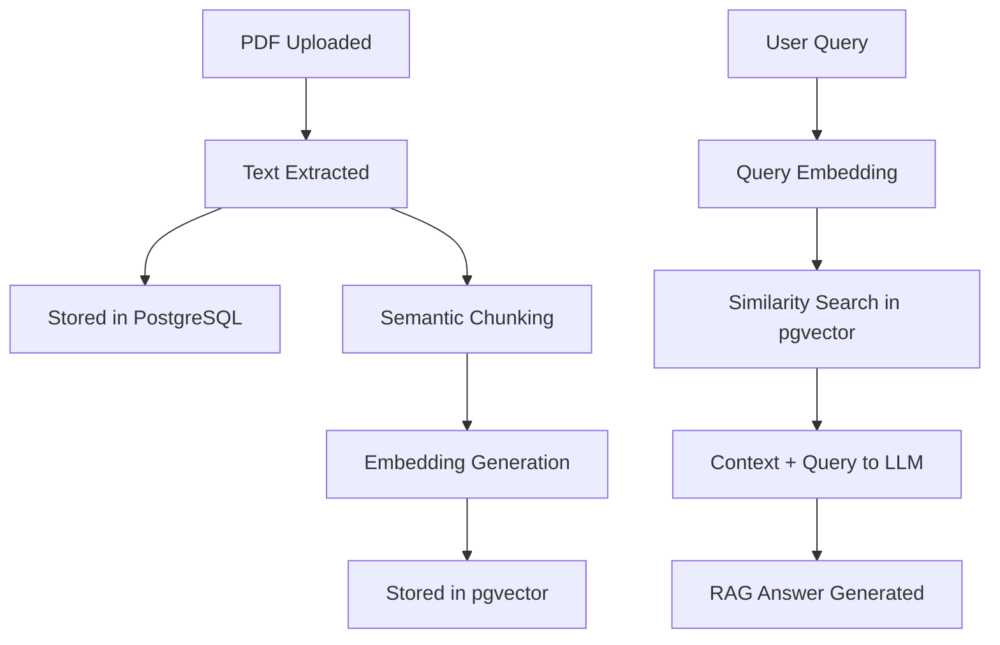

# AI & RAG Blueprint: Scaling to Semantic Search

This directory holds the blueprints, utility designs, and guidelines for upgrading our Document Ingestion System into a full RAG (Retrieval-Augmented Generation) pipeline.

---

## High-Level RAG Architecture



---

## 1. Document Chunking Strategy
To avoid losing semantic context and keep token usage efficient, we will chunk documents before embedding them:
- **Chunk Size**: 500-1000 characters.
- **Overlap**: 10% to 20% (e.g., 100-200 characters) to ensure sentence contexts aren't cut in half.
- **Method**: Use `RecursiveCharacterTextSplitter` from langchain/llama_index or a custom regex-based splitter that splits on paragraphs `\n\n`, sentences `. `, and spaces ` `.

**Example implementation skeleton (`ai/chunker.py`):**
```python
def chunk_text(text: str, chunk_size: int = 1000, overlap: int = 200) -> list[str]:
    # Placeholder for recursive character splitting
    chunks = []
    start = 0
    while start < len(text):
        end = min(start + chunk_size, len(text))
        chunks.append(text[start:end])
        start += chunk_size - overlap
    return chunks
```

## 2. Generating Embeddings
Convert clean text chunks into high-dimensional vectors:
- **Provider**: OpenAI (`text-embedding-3-small` / 1536 dimensions) or local SentenceTransformers (`all-MiniLM-L6-v2` / 384 dimensions).
- **Batching**: Generate embeddings in batches of 10-100 chunks to optimize API latency and rate limits.

## 3. Vector Database Integration
Store and index embeddings:
- **Option A (In-database)**: Use PostgreSQL `pgvector`. It keeps all metadata and embeddings in a single transactional database.
- **Option B (Dedicated Vector DB)**: Sync with Pinecone or Qdrant for very large-scale deployments.

**Similarity Search Query Example (`pgvector`):**
```sql
SELECT document_chunks.content, 
       document_chunks.document_id,
       1 - (document_chunks.embedding <=> :query_embedding) AS similarity
FROM document_chunks
WHERE 1 - (document_chunks.embedding <=> :query_embedding) > :similarity_threshold
ORDER BY document_chunks.embedding <=> :query_embedding
LIMIT :top_k;
```

## 4. Prompt Engineering & LLM Orchestration
Feed retrieved context to an LLM (e.g., GPT-4o, Claude 3.5 Sonnet) using a prompt template:
```text
Context information is below.
---------------------
{retrieved_context}
---------------------
Given the context information and not prior knowledge, answer the query.
Query: {user_query}
Answer:
```
