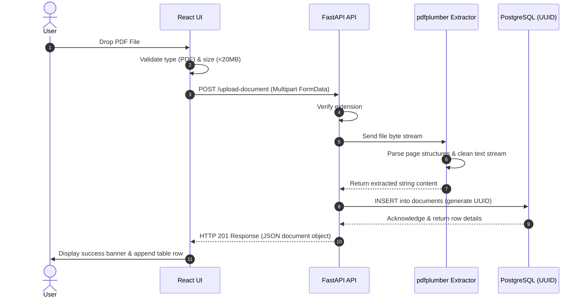
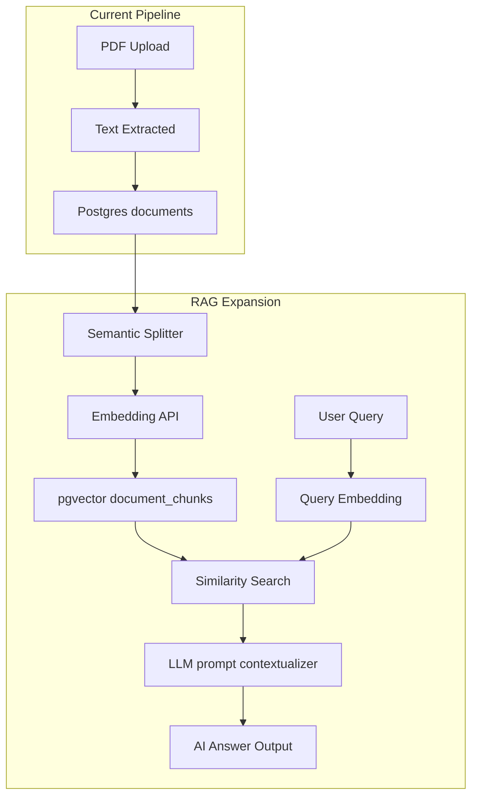

# System Architecture & Design Specification

This document provides a deep dive into IngestEngine's design patterns, layer configurations, and structural RAG evolution paths.

---

## 1. High-Level Data Flow

The following diagram illustrates how a file moves from drag-and-drop to text persistence:

---

## 2. Layer Architecture

### 2.1 Client Layer (Frontend SPA)
The client interface is structured around single-responsibility React components:
- **`FileUpload.tsx`**: State machine managing the dragging state, file format confirmation, payload size gating, and HTTP progress visual indicators.
- **`DocumentList.tsx`**: High-performance grid presenting system statistics and listing processed items.
- **`DocumentViewer.tsx`**: Text rendering drawer. Displays metrics like character and word count alongside raw copy commands.

### 2.2 API Layer (Backend)
- **FastAPI Framework**: Handles routing, asynchronous request handlers, and automatic validation schema generation.
- **Validation**: Enforced via Pydantic model configurations (see `schemas.py`).
- **Processing Engine**: The text extraction process is isolated within `pdf_processor.py`, running in-memory without disk writes for increased speed and filesystem isolation.

### 2.3 Database Layer (Storage)
- **Engine**: PostgreSQL.
- **Index Optimization**: Created `idx_documents_created_at` index on the `created_at` field to prevent list queries from slowing down as the table grows.
- **Identities**: UUIDv4 keys are generated at the SQL database layer to avoid conflicts during future data syncs or vector shard divisions.

---

## 3. Future RAG + Vector DB Integration Plan

To expand this project into a Retrieval-Augmented Generation context, the following architecture will be deployed:

### Key Expansion Steps
1. **Vector DB Integration**: Enable `pgvector` extension in the existing PostgreSQL container or spin up an external Pinecone service.
2. **Text Chunking**: Slice the raw document `content` into overlapping chunks (e.g. 512 tokens with 10% overlap).
3. **Embeddings Pipeline**: Send text chunks to an embeddings service (OpenAI API or a local SentenceTransformers instance) to retrieve high-dimensional vectors (e.g., 1536 dimensions for `text-embedding-3-small`).
4. **Semantic Indexing**: Insert these vectors into a new `document_chunks` table referencing the source document ID. Add an HNSW index to accelerate similarity queries.
