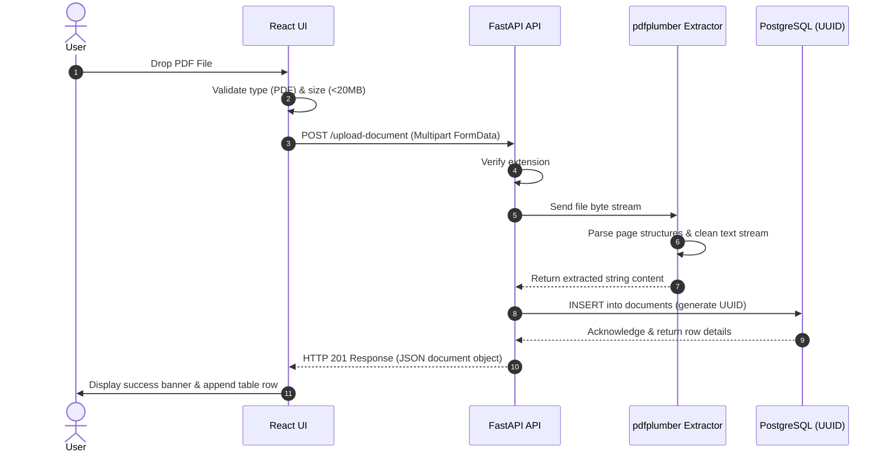
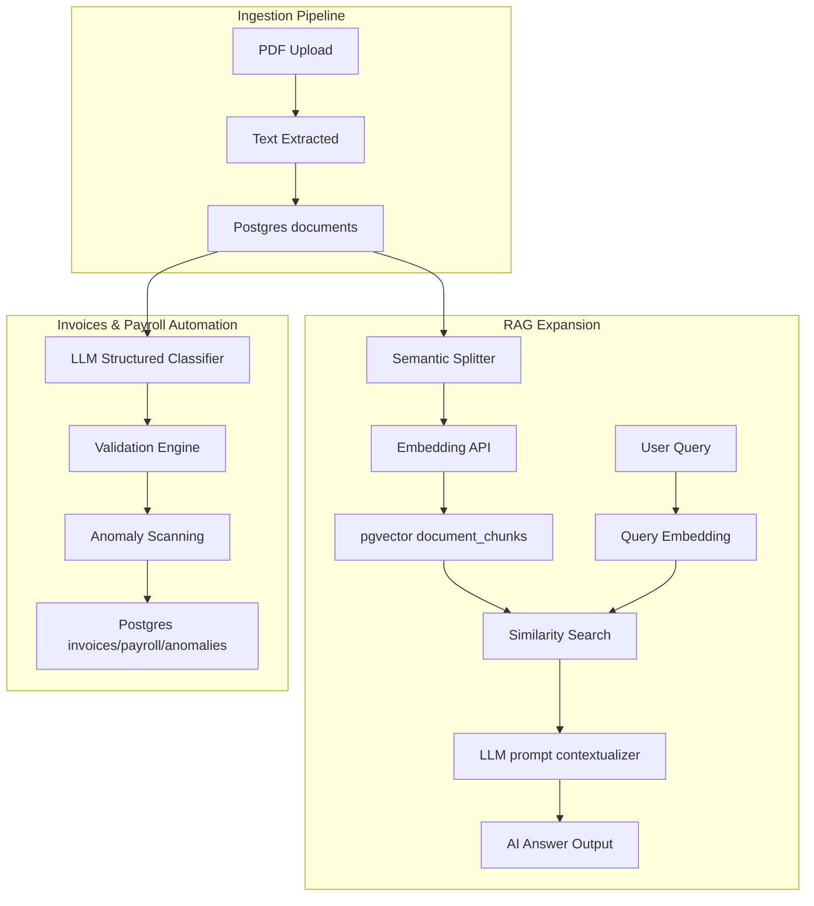

# System Architecture & Design Specification

This document provides a deep dive into IngestEngine's design patterns, layer configurations, and structural RAG evolution paths.

---

## 1. High-Level Data Flow

The following diagram illustrates how a file moves from drag-and-drop to text persistence:

---

## 2. Layer Architecture

### 2.1 Client Layer (Frontend SPA)
The client interface is structured around single-responsibility React components:
- **`FileUpload.tsx`**: State machine managing the dragging state, file format confirmation, payload size gating, and HTTP progress visual indicators.
- **`DocumentList.tsx`**: High-performance grid presenting system statistics and listing processed items.
- **`DocumentViewer.tsx`**: Text rendering drawer. Displays metrics like character and word count alongside raw copy commands.
- **`Dashboard.tsx` (Finance Operations)**: Control panel managing financial stats, transactional list grids, and Operational Risk compliance alerts.

### 2.2 API Layer (Backend)
- **FastAPI Framework**: Handles routing, asynchronous request handlers, and automatic validation schema generation.
- **Validation**: Enforced via Pydantic model configurations (see `schemas.py`) and programmatic math checking (see `validator.py`).
- **Invoice & Payroll Modules**: Custom services under `/modules/invoice_automation/` executing compliance validations, duplicate detections, and anomaly triggers on PostgreSQL data.
- **Processing Engine**: The text extraction process is isolated within `pdf_processor.py`, running in-memory without disk writes for increased speed and filesystem isolation.

### 2.3 Database Layer (Storage)
- **Engine**: PostgreSQL with pgvector extension enabled.
- **Container**: Runs on local Docker container (`local-postgres` mapping port `5433 -> 5432`).
- **Index Optimization**: Created `idx_documents_created_at` index on the `created_at` field, and HNSW indexes on chunk embeddings for cosine distance search.
- **Identities**: UUIDv4 keys are generated at the SQL database layer to avoid conflicts during future data syncs or vector shard divisions.

---

## 3. RAG + Vector DB Integration

The project employs a fully operational Retrieval-Augmented Generation context:

### Key Integration Steps
1. **Vector DB Integration**: Enabling the `vector` extension inside the PostgreSQL server.
2. **Text Chunking**: Slices raw document content into 600-character windows with 150-character sentence-boundary overlaps.
3. **Embeddings Pipeline**: Generates 1536-dimensional vectors for text chunks via OpenAI or a local mock vector fallback.
4. **Auditing Sync**: Intercepts ingested text to parse invoice or payroll models, run calculations validation, and register active compliance anomalies.

